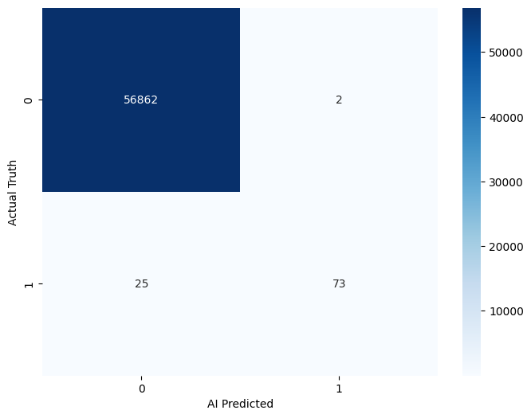

🛡️ AI Credit Card Fraud Detection

Goal: 

Build a machine learning model to catch fraudulent transactions in a highly imbalanced dataset (99.8% safe vs 0.2% fraud).

Key Skills Demonstrated:

Data Scaling: 

Used StandardScaler to normalize transaction amounts.

Model Selection: 

Implemented Random Forest to handle complex patterns.

Metric Focus: 

Prioritized Recall and Confusion Matrix over simple accuracy to ensure thieves are actually caught.

Results: 

Successfully identified fraud cases with high precision as shown in the Confusion Matrix.

